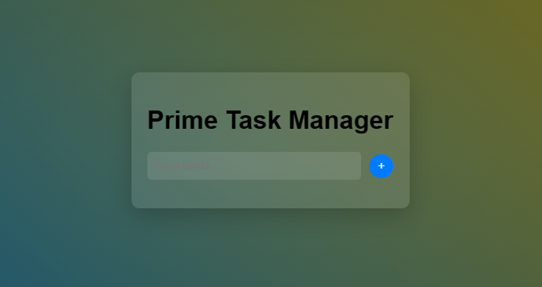

# Futuristic Task Manager

Um gerenciador de tarefas futurista com um design moderno e interações avançadas, permitindo que os usuários adicionem, editem, movam e excluam tarefas de maneira eficiente.

## Funcionalidades

- Adicione tarefas com facilidade usando o botão de adicionar (+)
- Edite o texto de uma tarefa existente clicando no botão "Editar"
- Mova a ordem das tarefas para cima ou para baixo com os botões "Mover"
- Exclua tarefas indesejadas com o botão "Excluir"

## Design

O design do aplicativo apresenta:

- Um fundo animado gradiente para criar um visual futurista e dinâmico
- Sombras estilizadas nas tarefas para um efeito tridimensional
- Botões de ação com cores vibrantes e animações de destaque

## Demonstração

## Como usar

1. Clone este repositório em sua máquina local.
2. Abra o arquivo `index.html` em um navegador da web.
3. Comece a gerenciar suas tarefas futuristas!

## Tecnologias Utilizadas

- HTML
- CSS
- JavaScript

## Contribuindo

Contribuições são bem-vindas! Sinta-se à vontade para abrir uma "issue" ou enviar um "pull request" com melhorias, correções ou novos recursos.

## Licença

Este projeto está licenciado sob a Licença MIT. Consulte o arquivo [LICENSE](LICENSE) para obter mais detalhes.

